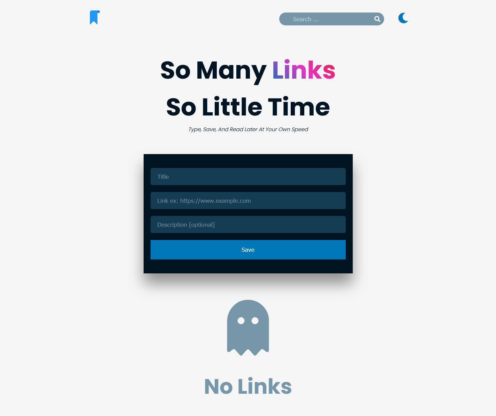
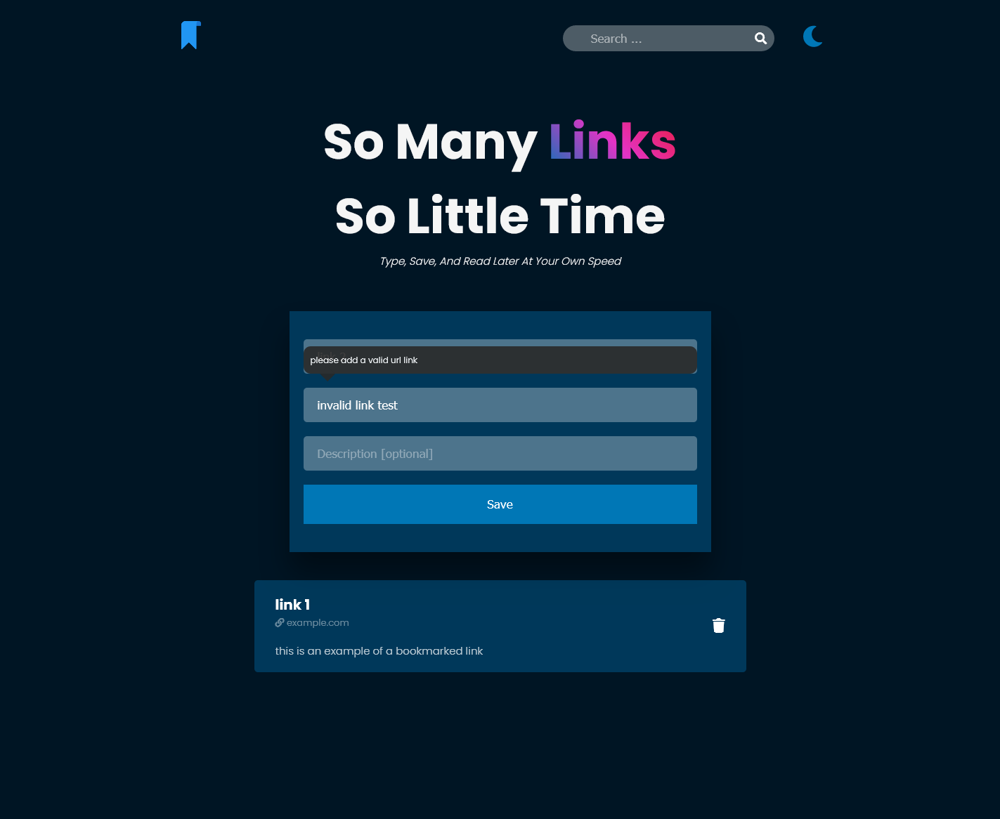
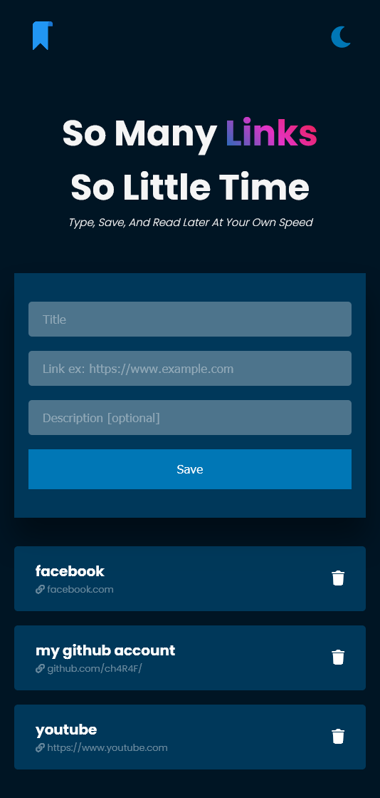

# linkeep
linkeep is a local bookmark where you can save your links untill get back, It doesn't use any kind of databases it just use your browser's localStorage
> built with pure Css and Vanilla Javascript
### screenshots

> this is not a real app, I just wanted to practice working with browsers' localStorage.
